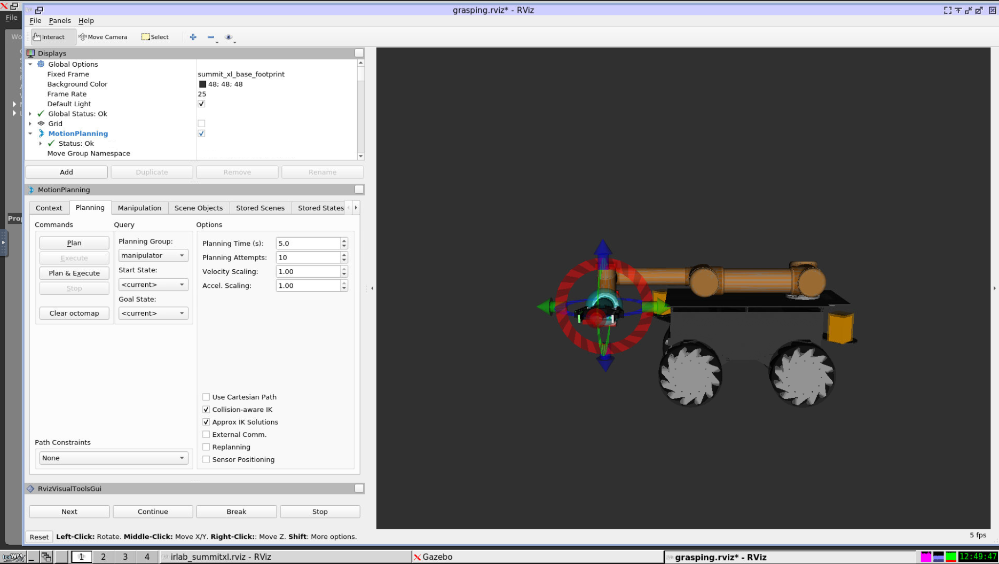

# Rosdocked-irlab
A docker container with some of the robotic simulations from the cloud robotics initiative @ ICCLab

## TL;DR

Run our ROS noetic environment including the workspace and projects

	cd WORKSPACE
	docker-compose -f docker-compose-cpu.yml up

A container (robopaas/rosdocked-noetic-cpu:latest) will be pulled and started. 
Another container running noVNC will be started and you'll be able to access it and see the GUI through a browser at: http://localhost

In order to access the container and start our components, in another console, you'll have to find the ros container and enter it, e.g.:
	
	docker ps
	docker exec -it workspace_ros_1 bash

You can try our projects within it, e.g., to run the robot navigation project:

	roslaunch icclab_summit_xl irlab_sim_summit_xls_complete.launch
	
Or to run the grasping project:

	roslaunch icclab_summit_xl irlab_sim_summit_xls_grasping.launch
	
In the browser you will see Gazebo and Rviz and you'll be able to control the robot from there.

 

## Longer story (Only if you need to rebuild / edit code)

We are now using multi-stage build for this container.

We are currently using 3 different "base images" to which we add all our repos and source code in a subsequent step.

Base images are built running build.sh from each of the base image folders:

- BASE_CPU (run these containers on machines without nvidia GPU support)
- BASE_GPU (for hosts with Nvidia GPUs)
- BASE_K8S (run as k8s containers on nodes with GPU)

You can use scripts in the WORKSPACE directory to add our catkin workspace to any of the base images.
In WORKSPACE you'll also find scripts for running the images either as docker compositions or standalone.

### NOTE on Building GPU/K8S images:

Our GPU/K8S use nvidia GPUs, to build you need a nvidia GPU + configure the nvidia docker runtime to be run as default (i.e., also when calling nvidia-docker build). You should edit your /etc/docker/daemon.json to look like this:

	{
	    "default-runtime": "nvidia",	
	    "runtimes": {
		"nvidia": {
		    "path": "nvidia-container-runtime",
		    "runtimeArgs": []
		}
	    }
	}
